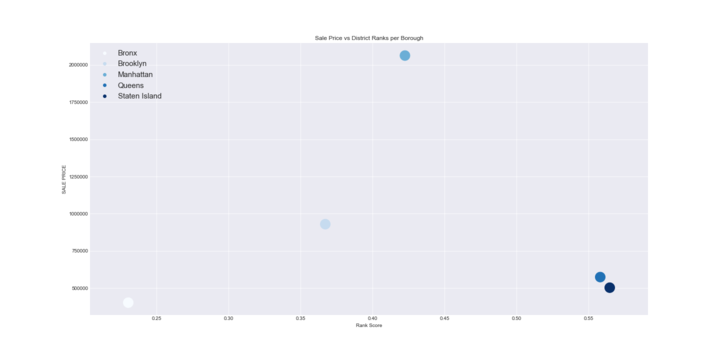

```python
from pprint import pprint
import numpy as np
import pandas as pd
import requests as req
import json
import pickle
import seaborn as sns
import matplotlib.pyplot as plt
```


#Get list of NYC school districts from school digger API for district list
#School digger api credentials

#Lists of all NYC zip codes obtained from health.ny.gov 
NYC_zips = [10455, 10459, 10474, 10463, 10471, 10466, 10469, 10470, 10475, 10461, 10453, 10457, 
            10460, 10458, 10467, 10468, 10451, 10452, 10456, 10454, 10462,10464, 10465, 10472, 
            10473, 11212, 11213, 11216, 11233, 11238, 11209, 11214, 11228, 11204, 11218,
            11219, 11230, 11234, 11236, 11239, 11223, 11224, 11229, 11235, 11201,
            11205, 11215, 11217, 11231, 11203, 11210, 11225, 11226, 11207, 11208,
            11211, 11222, 11220, 11232, 11206, 11221, 11237, 10026, 10027, 10030,
            10037, 10039, 10001, 10011, 10018, 10019, 10020, 10036, 10029, 10035, 10010, 
            10016, 10017, 10022, 10012, 10013, 10014, 10004, 10005, 10006, 10007, 10038, 
            10280, 10002, 10003, 10009, 10021,10028, 10044, 10065, 10075, 10128, 10023, 10024, 10025, 10031, 10032,
            10033, 10034, 10040, 11361, 11362, 11363, 11364, 11354, 11355, 11356, 11357, 11358, 11359,
            11360, 11365, 11366, 11367, 11412, 11423, 11432, 11433, 11434, 11435, 11436, 11101, 
            11102, 11103, 11104, 11105, 11106, 11374, 11375, 11379, 11385, 11691, 11692, 11693, 
            11694, 11695, 11697, 11004, 11005, 11411, 11413, 11422, 11426, 11427, 11428, 11429, 
            11414, 11415, 11416, 11417, 11418, 11419, 11420, 11421, 11368, 11369, 11370, 11372, 
            11373, 11377, 11378, 10302, 10303, 10310, 10306, 10307, 10308, 10309, 10312, 10301, 10304, 10305, 10314]
```


```python
# url_list= []

# #Loop through list of boros to create request url's
# for zipcode in NYC_zips:
#     target_url = "https://api.schooldigger.com/v1.1/districts?st=NY&zip=%s&appID=6c0fc6b7&appKey=c9afc046a1198a993222f9b6107ffb47" % (zipcode)
#     print(target_url)
#     url_list.append(target_url)

# pickle_out = open("zips.pickle", "wb")
# pickle.dump(url_list, pickle_out)
# pickle_out.close()

pickle_in = open("zips.pickle", "rb")
url_list = pickle.load(pickle_in)
```


```python
# #Create request for each url
# request_list = []
# for url in url_list:
#     response = req.get(url).json()
#     request_list.append(response)

# pickle_out = open("requests.pickle", "wb")
# pickle.dump(request_list, pickle_out)
# pickle_out.close()

pickle_in = open("requests.pickle", "rb")
request_list = pickle.load(pickle_in)

  


```python
#Get all relevant info from API to create dataframe
#Get list of district ids from this call
district_ids = []
for request in district_details:
        dist_id = request["districtID"]
        district_ids.append(dist_id)
print("District IDs: " + str(len(district_ids)))

#Get district rankings list 2017. Using try and except because not every district has a rank score
district_rank = []
for request in district_details:
    try:
        rank = request["rankHistory"][0]["rankScore"]
        district_rank.append(rank)
    except: district_rank.append("Rank not available")
print("District Ranks: " + str(len(district_rank)))

#Get list of district names
district_names = []
for request in district_details:
    name = request["districtName"]
    district_names.append(name)
print("District names: " + str(len(district_names)))

#Get list of number of schools per district
num_schools = []
for request in district_details:
        schoolnum = request["numberTotalSchools"]
        num_schools.append(schoolnum)
print("Number of Schools: " + str(len(num_schools)))

#Get list of number of teachers per district
num_teachers = []
for request in district_details:
        teacher = request["districtYearlyDetails"][0]["numberOfTeachers"]
        num_teachers.append(teacher)
print("Number of Teachers: " + str(len((num_teachers))))

#Get list of number of students per district
num_students = []
for request in district_details:
        students = request["districtYearlyDetails"][0]["numberOfStudents"]
        num_students.append(students)
print("Number of students: " + str(len(num_students)))

#Get boro name
boro_list = []
for request in district_details:
    boro = request["county"]["countyName"]
    boro_list.append(boro)
print("Boro list: " + str(len(boro_list)))
```

    District IDs: 232
    District Ranks: 232
    District names: 232
    Number of Schools: 232
    Number of Teachers: 232
    Number of students: 232
    Boro list: 232
    


```python
#Create dataframe of rank and district size data
ranks_df = pd.DataFrame({"Rank Score": district_rank,
                         "Number of Schools": num_schools,
                         "Number of Teachers": num_teachers,
                         "Number of Students": num_students,
                         "District ID": district_ids,
                         "Borough List": boro_list,
                         "District Name": district_names})
ranks_df = ranks_df.dropna(how="any")
ranks_df["Borough List"] = ranks_df.replace({"Kings": "Brooklyn", "Richmond": "Staten Island", "New York": "Manhattan"})
ranks_df
```


<div>

  <thead>
    <tr style="text-align: right;">
      <th></th>
      <th>Borough List</th>
      <th>District ID</th>
      <th>District Name</th>
      <th>Number of Schools</th>
      <th>Number of Students</th>
      <th>Number of Teachers</th>
      <th>Rank Score</th>
    </tr>
  </thead>
  <tbody>
    <tr>
      <th>0</th>
      <td>Bronx</td>
      <td>3600986</td>
      <td>Girls Preparatory Charter School Of The Bronx</td>
      <td>1</td>
      <td>674.0</td>
      <td>48.3</td>
      <td>0.612974</td>
    </tr>
    <tr>
      <th>1</th>
      <td>Bronx</td>
      <td>3601073</td>
      <td>New Visions Charter High School For Humanities II</td>
      <td>1</td>
      <td>441.0</td>
      <td>34.0</td>
      <td>0.039312</td>
    </tr>
    <tr>
      <th>3</th>
      <td>Bronx</td>
      <td>3600963</td>
      <td>University Prep Charter High School</td>
      <td>1</td>
      <td>400.0</td>
      <td>32.9</td>
      <td>0.397215</td>
    </tr>
    <tr>
      <th>4</th>
      <td>Bronx</td>
      <td>3600111</td>
      <td>Bronx Lighthouse Charter School</td>
      <td>1</td>
      <td>658.0</td>
      <td>50.7</td>
      <td>Rank not available</td>
    </tr>
    <tr>
      <th>5</th>
      <td>Bronx</td>
      <td>3600090</td>
      <td>New York City Geographic District #12</td>
      <td>50</td>
      <td>24581.0</td>
      <td>1704.5</td>
      <td>0.131998</td>
    </tr>
    <tr>
      <th>6</th>
      <td>Bronx</td>
      <td>3601067</td>
      <td>Roads Charter School II</td>
      <td>1</td>
      <td>239.0</td>
      <td>23.8</td>
      <td>0.004914</td>
    </tr>
    <tr>
      <th>7</th>
      <td>Bronx</td>
      <td>3600161</td>
      <td>South Bronx Classical Charter School</td>
      <td>1</td>
      <td>438.0</td>
      <td>47.0</td>
      <td>0.975684</td>
    </tr>
    <tr>
      <th>8</th>
      <td>Bronx</td>
      <td>3600063</td>
      <td>Bronx Charter School For The Arts</td>
      <td>1</td>
      <td>318.0</td>
      <td>29.1</td>
      <td>0.816429</td>
    </tr>
    <tr>
      <th>9</th>
      <td>Bronx</td>
      <td>3600165</td>
      <td>Hyde Leadership Charter School</td>
      <td>1</td>
      <td>951.0</td>
      <td>91.3</td>
      <td>Rank not available</td>
    </tr>
    <tr>
      <th>10</th>
      <td>Bronx</td>
      <td>3601138</td>
      <td>Atmosphere Academy Public Charter School</td>
      <td>1</td>
      <td>130.0</td>
      <td>10.0</td>
      <td>0.200687</td>
    </tr>
    <tr>
      <th>11</th>
      <td>Bronx</td>
      <td>3600163</td>
      <td>International Leadership Charter School</td>
      <td>1</td>
      <td>350.0</td>
      <td>16.0</td>
      <td>0.536446</td>
    </tr>
    <tr>
      <th>12</th>
      <td>Bronx</td>
      <td>3601041</td>
      <td>New Visions Charter High School For The Humani...</td>
      <td>1</td>
      <td>508.0</td>
      <td>37.7</td>
      <td>0.219492</td>
    </tr>
    <tr>
      <th>13</th>
      <td>Bronx</td>
      <td>3601047</td>
      <td>New Visions Charter High School-Adv Math/Scie</td>
      <td>1</td>
      <td>454.0</td>
      <td>36.7</td>
      <td>0.121212</td>
    </tr>
    <tr>
      <th>14</th>
      <td>Bronx</td>
      <td>3601068</td>
      <td>Technical International Charter School</td>
      <td>1</td>
      <td>348.0</td>
      <td>28.0</td>
      <td>0.173883</td>
    </tr>
    <tr>
      <th>15</th>
      <td>Bronx</td>
      <td>3600089</td>
      <td>Bronx Charter School For Better Learning</td>
      <td>1</td>
      <td>499.0</td>
      <td>44.7</td>
      <td>0.804694</td>
    </tr>
    <tr>
      <th>16</th>
      <td>Bronx</td>
      <td>3601127</td>
      <td>Bronx Charter School For Better Learning II</td>
      <td>1</td>
      <td>73.0</td>
      <td>4.0</td>
      <td>Rank not available</td>
    </tr>
    <tr>
      <th>17</th>
      <td>Bronx</td>
      <td>3600088</td>
      <td>New York City Geographic District #11</td>
      <td>63</td>
      <td>40204.0</td>
      <td>2528.5</td>
      <td>0.324421</td>
    </tr>
    <tr>
      <th>18</th>
      <td>Bronx</td>
      <td>3601096</td>
      <td>Success Academy Charter School-Bronx 3</td>
      <td>1</td>
      <td>335.0</td>
      <td>17.9</td>
      <td>0.987008</td>
    </tr>
    <tr>
      <th>19</th>
      <td>Bronx</td>
      <td>3601005</td>
      <td>Equality Charter School</td>
      <td>1</td>
      <td>447.0</td>
      <td>37.9</td>
      <td>0.457746</td>
    </tr>
    <tr>
      <th>20</th>
      <td>Bronx</td>
      <td>3600955</td>
      <td>Icahn Charter School 3</td>
      <td>1</td>
      <td>316.0</td>
      <td>26.0</td>
      <td>0.859511</td>
    </tr>
    <tr>
      <th>21</th>
      <td>Bronx</td>
      <td>3600995</td>
      <td>Icahn Charter School 4</td>
      <td>1</td>
      <td>318.0</td>
      <td>22.9</td>
      <td>0.961234</td>
    </tr>
    <tr>
      <th>22</th>
      <td>Bronx</td>
      <td>3601049</td>
      <td>Icahn Charter School 5</td>
      <td>1</td>
      <td>248.0</td>
      <td>21.9</td>
      <td>0.959901</td>
    </tr>
    <tr>
      <th>24</th>
      <td>Bronx</td>
      <td>3600042</td>
      <td>Bronx Preparatory Charter School</td>
      <td>1</td>
      <td>709.0</td>
      <td>56.9</td>
      <td>Rank not available</td>
    </tr>
    <tr>
      <th>25</th>
      <td>Bronx</td>
      <td>3601066</td>
      <td>Children's Aid College Preparatory Charter School</td>
      <td>1</td>
      <td>305.0</td>
      <td>9.0</td>
      <td>0.782062</td>
    </tr>
    <tr>
      <th>26</th>
      <td>Bronx</td>
      <td>3600049</td>
      <td>Icahn Charter School 1</td>
      <td>1</td>
      <td>328.0</td>
      <td>23.9</td>
      <td>0.747827</td>
    </tr>
    <tr>
      <th>27</th>
      <td>Bronx</td>
      <td>3601069</td>
      <td>Icahn Charter School 6</td>
      <td>1</td>
      <td>216.0</td>
      <td>18.0</td>
      <td>0.834451</td>
    </tr>
    <tr>
      <th>28</th>
      <td>Bronx</td>
      <td>3600087</td>
      <td>New York City Geographic District #10</td>
      <td>85</td>
      <td>56031.0</td>
      <td>3781.5</td>
      <td>0.282232</td>
    </tr>
    <tr>
      <th>29</th>
      <td>Bronx</td>
      <td>3600968</td>
      <td>Bronx Community Charter School</td>
      <td>1</td>
      <td>410.0</td>
      <td>43.0</td>
      <td>0.314669</td>
    </tr>
    <tr>
      <th>30</th>
      <td>Bronx</td>
      <td>3600967</td>
      <td>Bglig-Shirley Rodriguez-Remeneski Charter School</td>
      <td>1</td>
      <td>430.0</td>
      <td>29.9</td>
      <td>0.353965</td>
    </tr>
    <tr>
      <th>31</th>
      <td>Bronx</td>
      <td>3601125</td>
      <td>Family Life Academy Charter School III</td>
      <td>1</td>
      <td>154.0</td>
      <td>8.4</td>
      <td>Rank not available</td>
    </tr>
    <tr>
      <th>...</th>
      <td>...</td>
      <td>...</td>
      <td>...</td>
      <td>...</td>
      <td>...</td>
      <td>...</td>
      <td>...</td>
    </tr>
    <tr>
      <th>199</th>
      <td>Manhattan</td>
      <td>3601039</td>
      <td>Success Academy Charter School-Upper West</td>
      <td>1</td>
      <td>542.0</td>
      <td>36.5</td>
      <td>0.996647</td>
    </tr>
    <tr>
      <th>200</th>
      <td>Manhattan</td>
      <td>3600078</td>
      <td>New York City Geographic District # 3</td>
      <td>45</td>
      <td>21988.0</td>
      <td>1497.6</td>
      <td>0.508534</td>
    </tr>
    <tr>
      <th>201</th>
      <td>Manhattan</td>
      <td>3600167</td>
      <td>New Heights Academy Charter School</td>
      <td>1</td>
      <td>746.0</td>
      <td>51.9</td>
      <td>Rank not available</td>
    </tr>
    <tr>
      <th>202</th>
      <td>Manhattan</td>
      <td>3601075</td>
      <td>Kipp Nyc Washington Heights Academy Charter Sc...</td>
      <td>1</td>
      <td>846.0</td>
      <td>87.9</td>
      <td>0.763261</td>
    </tr>
    <tr>
      <th>203</th>
      <td>Manhattan</td>
      <td>3600083</td>
      <td>New York City Geographic District # 6</td>
      <td>48</td>
      <td>23477.0</td>
      <td>1609.0</td>
      <td>0.318995</td>
    </tr>
    <tr>
      <th>204</th>
      <td>Manhattan</td>
      <td>3601024</td>
      <td>Inwood Academy For Leadership Charter School</td>
      <td>1</td>
      <td>698.0</td>
      <td>48.6</td>
      <td>0.285915</td>
    </tr>
    <tr>
      <th>205</th>
      <td>Manhattan</td>
      <td>3601110</td>
      <td>Success Academy Charter School - Washington He...</td>
      <td>1</td>
      <td>241.0</td>
      <td>12.9</td>
      <td>Rank not available</td>
    </tr>
    <tr>
      <th>206</th>
      <td>Manhattan</td>
      <td>3600952</td>
      <td>The Equity Project Charter School</td>
      <td>1</td>
      <td>475.0</td>
      <td>32.2</td>
      <td>0.615807</td>
    </tr>
    <tr>
      <th>207</th>
      <td>Queens</td>
      <td>3600099</td>
      <td>New York City Geographic District #26</td>
      <td>32</td>
      <td>31868.0</td>
      <td>1766.9</td>
      <td>0.844857</td>
    </tr>
    <tr>
      <th>208</th>
      <td>Queens</td>
      <td>3600122</td>
      <td>New York City Geographic District #25</td>
      <td>45</td>
      <td>36647.0</td>
      <td>2315.7</td>
      <td>0.679347</td>
    </tr>
    <tr>
      <th>209</th>
      <td>Queens</td>
      <td>3601035</td>
      <td>Riverton Street Charter School</td>
      <td>1</td>
      <td>833.0</td>
      <td>41.7</td>
      <td>0.604121</td>
    </tr>
    <tr>
      <th>210</th>
      <td>Queens</td>
      <td>3601136</td>
      <td>New Visions Charter High School-Adv Ma/Sci IV</td>
      <td>1</td>
      <td>125.0</td>
      <td>9.9</td>
      <td>0.184275</td>
    </tr>
    <tr>
      <th>211</th>
      <td>Queens</td>
      <td>3601034</td>
      <td>Rochdale Early Advantage Charter School</td>
      <td>1</td>
      <td>247.0</td>
      <td>21.9</td>
      <td>0.612322</td>
    </tr>
    <tr>
      <th>212</th>
      <td>Queens</td>
      <td>3600100</td>
      <td>New York City Geographic District #28</td>
      <td>50</td>
      <td>41096.0</td>
      <td>2388.7</td>
      <td>0.516795</td>
    </tr>
    <tr>
      <th>214</th>
      <td>Queens</td>
      <td>3600102</td>
      <td>New York City Geographic District #30</td>
      <td>48</td>
      <td>39993.0</td>
      <td>2505.9</td>
      <td>0.573619</td>
    </tr>
    <tr>
      <th>215</th>
      <td>Queens</td>
      <td>3600057</td>
      <td>Our World Neighborhood Charter School</td>
      <td>1</td>
      <td>715.0</td>
      <td>49.0</td>
      <td>0.800553</td>
    </tr>
    <tr>
      <th>216</th>
      <td>Queens</td>
      <td>3600957</td>
      <td>Voice Charter School Of New York</td>
      <td>1</td>
      <td>628.0</td>
      <td>41.8</td>
      <td>0.716955</td>
    </tr>
    <tr>
      <th>217</th>
      <td>Queens</td>
      <td>3601082</td>
      <td>Middle Village Preparatory Charter School</td>
      <td>1</td>
      <td>369.0</td>
      <td>25.9</td>
      <td>0.875601</td>
    </tr>
    <tr>
      <th>218</th>
      <td>Queens</td>
      <td>3601018</td>
      <td>Challenge Preparatory Charter School</td>
      <td>1</td>
      <td>580.0</td>
      <td>34.1</td>
      <td>0.352715</td>
    </tr>
    <tr>
      <th>221</th>
      <td>Queens</td>
      <td>3601118</td>
      <td>Success Academy Charter School - Springfield G...</td>
      <td>1</td>
      <td>242.0</td>
      <td>12.6</td>
      <td>Rank not available</td>
    </tr>
    <tr>
      <th>222</th>
      <td>Queens</td>
      <td>3601116</td>
      <td>Success Academy Charter School - Rosedale</td>
      <td>1</td>
      <td>252.0</td>
      <td>11.9</td>
      <td>Rank not available</td>
    </tr>
    <tr>
      <th>223</th>
      <td>Queens</td>
      <td>3600101</td>
      <td>New York City Geographic District #29</td>
      <td>46</td>
      <td>27809.0</td>
      <td>1699.8</td>
      <td>0.334052</td>
    </tr>
    <tr>
      <th>224</th>
      <td>Queens</td>
      <td>3600123</td>
      <td>New York City Geographic District #27</td>
      <td>62</td>
      <td>45845.0</td>
      <td>2898.7</td>
      <td>0.412128</td>
    </tr>
    <tr>
      <th>225</th>
      <td>Queens</td>
      <td>3600098</td>
      <td>New York City Geographic District #24</td>
      <td>57</td>
      <td>58907.0</td>
      <td>3547.8</td>
      <td>0.546008</td>
    </tr>
    <tr>
      <th>226</th>
      <td>Queens</td>
      <td>3600059</td>
      <td>Renaissance Charter School</td>
      <td>1</td>
      <td>544.0</td>
      <td>44.1</td>
      <td>Rank not available</td>
    </tr>
    <tr>
      <th>227</th>
      <td>Queens</td>
      <td>3601056</td>
      <td>Central Queens Academy Charter School</td>
      <td>1</td>
      <td>405.0</td>
      <td>30.9</td>
      <td>0.936082</td>
    </tr>
    <tr>
      <th>228</th>
      <td>Queens</td>
      <td>3601053</td>
      <td>Academy Of The City Charter School</td>
      <td>1</td>
      <td>416.0</td>
      <td>23.0</td>
      <td>0.838223</td>
    </tr>
    <tr>
      <th>229</th>
      <td>Staten Island</td>
      <td>3601019</td>
      <td>New World Preparatory Charter School</td>
      <td>1</td>
      <td>374.0</td>
      <td>7.9</td>
      <td>0.402062</td>
    </tr>
    <tr>
      <th>230</th>
      <td>Staten Island</td>
      <td>3600103</td>
      <td>New York City Geographic District #31</td>
      <td>72</td>
      <td>61899.0</td>
      <td>3933.4</td>
      <td>0.564713</td>
    </tr>
    <tr>
      <th>231</th>
      <td>Staten Island</td>
      <td>3601037</td>
      <td>Staten Island Community Charter School</td>
      <td>0</td>
      <td>325.0</td>
      <td>30.9</td>
      <td>0.60533</td>
    </tr>
  </tbody>
</table>
<p>211 rows × 7 columns</p>
</div>


```python
#Drop charter schools to leave only public school districts
public_ranks_df = ranks_df[ranks_df["District Name"].str.contains("Charter") == False]
#Create new column for 
public_ranks_df["Students Per Teacher"] = public_ranks_df["Number of Students"] / public_ranks_df["Number of Teachers"]
public_ranks_df
```

    C:\Users\Linda\Anaconda3\lib\site-packages\ipykernel_launcher.py:4: SettingWithCopyWarning: 
    A value is trying to be set on a copy of a slice from a DataFrame.
    Try using .loc[row_indexer,col_indexer] = value instead
    
    See the caveats in the documentation: http://pandas.pydata.org/pandas-docs/stable/indexing.html#indexing-view-versus-copy
      after removing the cwd from sys.path.
    


<div>

<table border="1" class="dataframe">
  <thead>
    <tr style="text-align: right;">
      <th></th>
      <th>Borough List</th>
      <th>District ID</th>
      <th>District Name</th>
      <th>Number of Schools</th>
      <th>Number of Students</th>
      <th>Number of Teachers</th>
      <th>Rank Score</th>
      <th>Students Per Teacher</th>
    </tr>
  </thead>
  <tbody>
    <tr>
      <th>5</th>
      <td>Bronx</td>
      <td>3600090</td>
      <td>New York City Geographic District #12</td>
      <td>50</td>
      <td>24581.0</td>
      <td>1704.5</td>
      <td>0.131998</td>
      <td>14.421238</td>
    </tr>
    <tr>
      <th>17</th>
      <td>Bronx</td>
      <td>3600088</td>
      <td>New York City Geographic District #11</td>
      <td>63</td>
      <td>40204.0</td>
      <td>2528.5</td>
      <td>0.324421</td>
      <td>15.900336</td>
    </tr>
    <tr>
      <th>28</th>
      <td>Bronx</td>
      <td>3600087</td>
      <td>New York City Geographic District #10</td>
      <td>85</td>
      <td>56031.0</td>
      <td>3781.5</td>
      <td>0.282232</td>
      <td>14.817136</td>
    </tr>
    <tr>
      <th>33</th>
      <td>Bronx</td>
      <td>3600084</td>
      <td>New York City Geographic District # 7</td>
      <td>42</td>
      <td>20197.0</td>
      <td>1455.3</td>
      <td>0.187446</td>
      <td>13.878238</td>
    </tr>
    <tr>
      <th>43</th>
      <td>Bronx</td>
      <td>3600086</td>
      <td>New York City Geographic District # 9</td>
      <td>70</td>
      <td>37209.0</td>
      <td>2506.8</td>
      <td>0.215531</td>
      <td>14.843226</td>
    </tr>
    <tr>
      <th>61</th>
      <td>Bronx</td>
      <td>3600085</td>
      <td>New York City Geographic District # 8</td>
      <td>56</td>
      <td>29413.0</td>
      <td>2043.6</td>
      <td>0.240227</td>
      <td>14.392738</td>
    </tr>
    <tr>
      <th>75</th>
      <td>Brooklyn</td>
      <td>3600095</td>
      <td>New York City Geographic District #17</td>
      <td>50</td>
      <td>23325.0</td>
      <td>1548.5</td>
      <td>0.303809</td>
      <td>15.062964</td>
    </tr>
    <tr>
      <th>81</th>
      <td>Brooklyn</td>
      <td>3600121</td>
      <td>New York City Geographic District #23</td>
      <td>29</td>
      <td>10037.0</td>
      <td>691.4</td>
      <td>0.188511</td>
      <td>14.516922</td>
    </tr>
    <tr>
      <th>87</th>
      <td>Brooklyn</td>
      <td>3600091</td>
      <td>New York City Geographic District #13</td>
      <td>41</td>
      <td>21514.0</td>
      <td>1293.2</td>
      <td>0.347305</td>
      <td>16.636251</td>
    </tr>
    <tr>
      <th>88</th>
      <td>Brooklyn</td>
      <td>3600151</td>
      <td>New York City Geographic District #20</td>
      <td>43</td>
      <td>49749.0</td>
      <td>3134.5</td>
      <td>0.700053</td>
      <td>15.871431</td>
    </tr>
    <tr>
      <th>93</th>
      <td>Brooklyn</td>
      <td>3600153</td>
      <td>New York City Geographic District #22</td>
      <td>39</td>
      <td>35305.0</td>
      <td>2106.0</td>
      <td>0.550919</td>
      <td>16.764008</td>
    </tr>
    <tr>
      <th>99</th>
      <td>Brooklyn</td>
      <td>3600096</td>
      <td>New York City Geographic District #18</td>
      <td>35</td>
      <td>16571.0</td>
      <td>1131.6</td>
      <td>0.269706</td>
      <td>14.643867</td>
    </tr>
    <tr>
      <th>101</th>
      <td>Brooklyn</td>
      <td>3600152</td>
      <td>New York City Geographic District #21</td>
      <td>40</td>
      <td>34757.0</td>
      <td>2224.7</td>
      <td>0.489636</td>
      <td>15.623230</td>
    </tr>
    <tr>
      <th>106</th>
      <td>Brooklyn</td>
      <td>3600092</td>
      <td>New York City Geographic District #15</td>
      <td>47</td>
      <td>31036.0</td>
      <td>2251.1</td>
      <td>0.542819</td>
      <td>13.787037</td>
    </tr>
    <tr>
      <th>127</th>
      <td>Brooklyn</td>
      <td>3600120</td>
      <td>New York City Geographic District #19</td>
      <td>49</td>
      <td>23873.0</td>
      <td>1552.4</td>
      <td>0.183348</td>
      <td>15.378124</td>
    </tr>
    <tr>
      <th>141</th>
      <td>Brooklyn</td>
      <td>3600119</td>
      <td>New York City Geographic District #14</td>
      <td>39</td>
      <td>19050.0</td>
      <td>1355.5</td>
      <td>0.340082</td>
      <td>14.053855</td>
    </tr>
    <tr>
      <th>152</th>
      <td>Brooklyn</td>
      <td>3600094</td>
      <td>New York City Geographic District #16</td>
      <td>26</td>
      <td>7600.0</td>
      <td>548.8</td>
      <td>0.238543</td>
      <td>13.848397</td>
    </tr>
    <tr>
      <th>153</th>
      <td>Brooklyn</td>
      <td>3600097</td>
      <td>New York City Geographic District #32</td>
      <td>27</td>
      <td>12590.0</td>
      <td>875.4</td>
      <td>0.251057</td>
      <td>14.381997</td>
    </tr>
    <tr>
      <th>168</th>
      <td>Manhattan</td>
      <td>3600081</td>
      <td>New York City Geographic District # 5</td>
      <td>29</td>
      <td>12586.0</td>
      <td>878.7</td>
      <td>0.222709</td>
      <td>14.323432</td>
    </tr>
    <tr>
      <th>176</th>
      <td>Manhattan</td>
      <td>3600077</td>
      <td>New York City Geographic District # 2</td>
      <td>117</td>
      <td>61702.0</td>
      <td>3951.7</td>
      <td>0.639155</td>
      <td>15.614040</td>
    </tr>
    <tr>
      <th>188</th>
      <td>Manhattan</td>
      <td>3600079</td>
      <td>New York City Geographic District # 4</td>
      <td>31</td>
      <td>13522.0</td>
      <td>1050.6</td>
      <td>0.34273</td>
      <td>12.870741</td>
    </tr>
    <tr>
      <th>197</th>
      <td>Manhattan</td>
      <td>3600076</td>
      <td>New York City Geographic District # 1</td>
      <td>29</td>
      <td>11286.0</td>
      <td>878.4</td>
      <td>0.502785</td>
      <td>12.848361</td>
    </tr>
    <tr>
      <th>200</th>
      <td>Manhattan</td>
      <td>3600078</td>
      <td>New York City Geographic District # 3</td>
      <td>45</td>
      <td>21988.0</td>
      <td>1497.6</td>
      <td>0.508534</td>
      <td>14.682158</td>
    </tr>
    <tr>
      <th>203</th>
      <td>Manhattan</td>
      <td>3600083</td>
      <td>New York City Geographic District # 6</td>
      <td>48</td>
      <td>23477.0</td>
      <td>1609.0</td>
      <td>0.318995</td>
      <td>14.591050</td>
    </tr>
    <tr>
      <th>207</th>
      <td>Queens</td>
      <td>3600099</td>
      <td>New York City Geographic District #26</td>
      <td>32</td>
      <td>31868.0</td>
      <td>1766.9</td>
      <td>0.844857</td>
      <td>18.036108</td>
    </tr>
    <tr>
      <th>208</th>
      <td>Queens</td>
      <td>3600122</td>
      <td>New York City Geographic District #25</td>
      <td>45</td>
      <td>36647.0</td>
      <td>2315.7</td>
      <td>0.679347</td>
      <td>15.825452</td>
    </tr>
    <tr>
      <th>212</th>
      <td>Queens</td>
      <td>3600100</td>
      <td>New York City Geographic District #28</td>
      <td>50</td>
      <td>41096.0</td>
      <td>2388.7</td>
      <td>0.516795</td>
      <td>17.204337</td>
    </tr>
    <tr>
      <th>214</th>
      <td>Queens</td>
      <td>3600102</td>
      <td>New York City Geographic District #30</td>
      <td>48</td>
      <td>39993.0</td>
      <td>2505.9</td>
      <td>0.573619</td>
      <td>15.959535</td>
    </tr>
    <tr>
      <th>223</th>
      <td>Queens</td>
      <td>3600101</td>
      <td>New York City Geographic District #29</td>
      <td>46</td>
      <td>27809.0</td>
      <td>1699.8</td>
      <td>0.334052</td>
      <td>16.360160</td>
    </tr>
    <tr>
      <th>224</th>
      <td>Queens</td>
      <td>3600123</td>
      <td>New York City Geographic District #27</td>
      <td>62</td>
      <td>45845.0</td>
      <td>2898.7</td>
      <td>0.412128</td>
      <td>15.815710</td>
    </tr>
    <tr>
      <th>225</th>
      <td>Queens</td>
      <td>3600098</td>
      <td>New York City Geographic District #24</td>
      <td>57</td>
      <td>58907.0</td>
      <td>3547.8</td>
      <td>0.546008</td>
      <td>16.603811</td>
    </tr>
    <tr>
      <th>230</th>
      <td>Staten Island</td>
      <td>3600103</td>
      <td>New York City Geographic District #31</td>
      <td>72</td>
      <td>61899.0</td>
      <td>3933.4</td>
      <td>0.564713</td>
      <td>15.736767</td>
    </tr>
  </tbody>
</table>
</div>


```python
#Get average teacher/student ratio per borough and average rank score per borough
public_ranks_df["Rank Score"] = public_ranks_df["Rank Score"].astype(float)
grouped_df = public_ranks_df.groupby(["Borough List"]).mean()
grouped_df = grouped_df.reset_index()
grouped_df
```

    C:\Users\Linda\Anaconda3\lib\site-packages\ipykernel_launcher.py:2: SettingWithCopyWarning: 
    A value is trying to be set on a copy of a slice from a DataFrame.
    Try using .loc[row_indexer,col_indexer] = value instead
    
    See the caveats in the documentation: http://pandas.pydata.org/pandas-docs/stable/indexing.html#indexing-view-versus-copy
      
    


<div>

<table border="1" class="dataframe">
  <thead>
    <tr style="text-align: right;">
      <th></th>
      <th>Borough List</th>
      <th>Number of Schools</th>
      <th>Number of Students</th>
      <th>Number of Teachers</th>
      <th>Rank Score</th>
      <th>Students Per Teacher</th>
    </tr>
  </thead>
  <tbody>
    <tr>
      <th>0</th>
      <td>Bronx</td>
      <td>61.000000</td>
      <td>34605.833333</td>
      <td>2336.700000</td>
      <td>0.230309</td>
      <td>14.708819</td>
    </tr>
    <tr>
      <th>1</th>
      <td>Brooklyn</td>
      <td>38.750000</td>
      <td>23783.916667</td>
      <td>1559.425000</td>
      <td>0.367149</td>
      <td>15.047340</td>
    </tr>
    <tr>
      <th>2</th>
      <td>Manhattan</td>
      <td>49.833333</td>
      <td>24093.500000</td>
      <td>1644.333333</td>
      <td>0.422485</td>
      <td>14.154964</td>
    </tr>
    <tr>
      <th>3</th>
      <td>Queens</td>
      <td>48.571429</td>
      <td>40309.285714</td>
      <td>2446.214286</td>
      <td>0.558115</td>
      <td>16.543588</td>
    </tr>
    <tr>
      <th>4</th>
      <td>Staten Island</td>
      <td>72.000000</td>
      <td>61899.000000</td>
      <td>3933.400000</td>
      <td>0.564713</td>
      <td>15.736767</td>
    </tr>
  </tbody>
</table>
</div>


```python
#Create x axis for bar graph
colors = sns.color_palette("Blues_r")

x_axis = np.arange(len(grouped_df))

# Create the ticks for our bar chart's x axis
tick_locations = [value+0.4 for value in x_axis]
plt.xticks(tick_locations, grouped_df["Borough List"])

#Create bar graph for teacher/student ratios
plt.bar(x_axis, grouped_df["Rank Score"], color=colors, align="edge")

fig = plt.gcf()
fig.set_size_inches(10,10)

plt.title("District Rank Score")
plt.xlabel("NYC Borough")
plt.ylabel("District Score")
plt.show()
```


```python
#Create x axis for bar graph
colors = sns.color_palette("Blues_r")

x_axis = np.arange(len(grouped_df))

# Create the ticks for our bar chart's x axis
tick_locations = [value+0.4 for value in x_axis]
plt.xticks(tick_locations, grouped_df["Borough List"])

#Create bar graph for teacher/student ratios
plt.bar(x_axis, grouped_df["Students Per Teacher"], color=colors, align="edge")

fig = plt.gcf()
fig.set_size_inches(10,10)

plt.title("Students Per Teacher")
plt.xlabel("NYC Borough")
plt.show()
```


```python
#Dependencies
import pandas as pd 
from matplotlib import pyplot as plt
import numpy as np 
import seaborn as sns 
import requests as req
import random 

#Read CSVs and Combine to One Dataframe
file_one = "rollingsales_bronx.csv"
file_two = "rollingsales_brooklyn.csv"
file_three = "rollingsales_manhattan.csv"
file_four = "rollingsales_queens.csv"
file_five = "rollingsales_statenisland.csv"

bronx_pd = pd.read_csv(file_one)
brooklyn_pd = pd.read_csv(file_two)
manhattan_pd = pd.read_csv(file_three)
queens_pd = pd.read_csv(file_four)
staten_island_pd = pd.read_csv(file_five)
sales_df = pd.concat([manhattan_pd, bronx_pd, brooklyn_pd, queens_pd, staten_island_pd])

#Clean missing rows, change Borough numbers to names and sort out residential buildings
sales_df['BOROUGH'] = sales_df['BOROUGH'].map({1:'Manhattan', 2:'Bronx', 3:'Brooklyn', 4:'Queens', 5:'Staten Island'})
sales_df['BUILDING CLASS'], sales_df['CATEGORY'] = sales_df['BUILDING CLASS CATEGORY'].str.split(' ', 1).str
del (sales_df['BUILDING CLASS CATEGORY'], sales_df['BLOCK'], sales_df['LOT'],  sales_df['EASE-MENT'],  sales_df['TAX CLASS AT PRESENT'],
     sales_df['TAX CLASS AT TIME OF SALE'])
sales_df = sales_df.replace('-', np.nan).dropna(thresh=7)
sales_df = sales_df[~sales_df['BUILDING CLASS'].isin(['11A'])]
sales_df[['BUILDING CLASS']] = sales_df[['BUILDING CLASS']].apply(pd.to_numeric)
sales_df[' SALE PRICE '] = pd.to_numeric(sales_df[' SALE PRICE ']) 
#Use Loop to sort out residential buildings

# Create a list to store the data
sale_type = []

# For each row in the column,
for row in sales_df['BUILDING CLASS']:
    if row < 4 :
        sale_type.append('Residential Sale')
    elif row == 6:
        sale_type.append('Residential Sale')
    elif row == 9:
        sale_type.append('Residential Sale')
    elif row == 10:
        sale_type.append('Residential Sale')
    elif row == 12:
        sale_type.append('Residential Sale')
    elif row == 13:
        sale_type.append('Residential Sale')
    elif row == 15:
        sale_type.append('Residential Sale')
    elif row == 16:
        sale_type.append('Residential Sale')
    elif row == 17:
        sale_type.append('Residential Sale')
    else:
        # Append Other
        sale_type.append('Other')
        
# Create a column from the list
sales_df['sale_type'] = sale_type

sales_df = sales_df[~sales_df['sale_type'].isin(['Other'])]

#Create Price Bins and Dataframe for later
price_bins = [0, 250000, 500000, 750000, 1000000, 1500000, 2000000, 3000000, 4000000, 1000000000]

# Create the names for the bins
bin_names = ['$0-250K', '$250K-$500K', '$500K-$750K', '$750K-$1M', '$1M-$1.5M', '$1.5M-$2M',
              '$2M-$3M', '$3M-$4M', '4000000+']

sales_df["Price Category"] = pd.cut(sales_df[' SALE PRICE '], price_bins, labels=bin_names)
sales_df
```


<div>

<table border="1" class="dataframe">
  <thead>
    <tr style="text-align: right;">
      <th></th>
      <th>BOROUGH</th>
      <th>NEIGHBORHOOD</th>
      <th>BUILDING CLASS AT PRESENT</th>
      <th>ADDRESS</th>
      <th>APARTMENT NUMBER</th>
      <th>ZIP CODE</th>
      <th>RESIDENTIAL UNITS</th>
      <th>COMMERCIAL UNITS</th>
      <th>TOTAL UNITS</th>
      <th>LAND SQUARE FEET</th>
      <th>GROSS SQUARE FEET</th>
      <th>YEAR BUILT</th>
      <th>BUILDING CLASS AT TIME OF SALE</th>
      <th>SALE PRICE</th>
      <th>SALE DATE</th>
      <th>BUILDING CLASS</th>
      <th>CATEGORY</th>
      <th>sale_type</th>
      <th>Price Category</th>
    </tr>
  </thead>
  <tbody>
    <tr>
      <th>0</th>
      <td>Manhattan</td>
      <td>INWOOD</td>
      <td>A5</td>
      <td>49 MARBLE HILL AVENUE</td>
      <td></td>
      <td>10463</td>
      <td>1.0</td>
      <td>0</td>
      <td>1</td>
      <td>1219</td>
      <td>1224</td>
      <td>1920</td>
      <td>A5</td>
      <td>635000.0</td>
      <td>8/18/17</td>
      <td>1</td>
      <td>ONE FAMILY DWELLINGS</td>
      <td>Residential Sale</td>
      <td>$500K-$750K</td>
    </tr>
    <tr>
      <th>1</th>
      <td>Manhattan</td>
      <td>WASHINGTON HEIGHTS LOWER</td>
      <td>A9</td>
      <td>16 SYLVAN TERRACE</td>
      <td></td>
      <td>10032</td>
      <td>1.0</td>
      <td>0</td>
      <td>1</td>
      <td>673</td>
      <td>1425</td>
      <td>1899</td>
      <td>A9</td>
      <td>1560000.0</td>
      <td>9/28/17</td>
      <td>1</td>
      <td>ONE FAMILY DWELLINGS</td>
      <td>Residential Sale</td>
      <td>$1.5M-$2M</td>
    </tr>
    <tr>
      <th>2</th>
      <td>Manhattan</td>
      <td>HARLEM-EAST</td>
      <td>A5</td>
      <td>104 EAST 101 STREET</td>
      <td></td>
      <td>10029</td>
      <td>1.0</td>
      <td>0</td>
      <td>1</td>
      <td>1607</td>
      <td>1466</td>
      <td>1890</td>
      <td>A5</td>
      <td>NaN</td>
      <td>3/31/17</td>
      <td>1</td>
      <td>ONE FAMILY DWELLINGS</td>
      <td>Residential Sale</td>
      <td>NaN</td>
    </tr>
    <tr>
      <th>3</th>
      <td>Manhattan</td>
      <td>HARLEM-EAST</td>
      <td>A5</td>
      <td>104 EAST 101ST STREET</td>
      <td></td>
      <td>10029</td>
      <td>1.0</td>
      <td>0</td>
      <td>1</td>
      <td>1607</td>
      <td>1466</td>
      <td>1890</td>
      <td>A5</td>
      <td>NaN</td>
      <td>2/4/17</td>
      <td>1</td>
      <td>ONE FAMILY DWELLINGS</td>
      <td>Residential Sale</td>
      <td>NaN</td>
    </tr>
    <tr>
      <th>4</th>
      <td>Manhattan</td>
      <td>HARLEM-EAST</td>
      <td>A9</td>
      <td>101B EAST 97TH STREET</td>
      <td></td>
      <td>10029</td>
      <td>1.0</td>
      <td>0</td>
      <td>1</td>
      <td>847</td>
      <td>1472</td>
      <td>1925</td>
      <td>A9</td>
      <td>NaN</td>
      <td>3/7/17</td>
      <td>1</td>
      <td>ONE FAMILY DWELLINGS</td>
      <td>Residential Sale</td>
      <td>NaN</td>
    </tr>
    <tr>
      <th>5</th>
      <td>Manhattan</td>
      <td>LOWER EAST SIDE</td>
      <td>S1</td>
      <td>515 GRAND STREET</td>
      <td></td>
      <td>10002</td>
      <td>1.0</td>
      <td>1</td>
      <td>2</td>
      <td>765</td>
      <td>1507</td>
      <td>1910</td>
      <td>S1</td>
      <td>NaN</td>
      <td>8/31/17</td>
      <td>1</td>
      <td>ONE FAMILY DWELLINGS</td>
      <td>Residential Sale</td>
      <td>NaN</td>
    </tr>
    <tr>
      <th>6</th>
      <td>Manhattan</td>
      <td>MURRAY HILL</td>
      <td>A4</td>
      <td>130 EAST 38TH STREET</td>
      <td></td>
      <td>10016</td>
      <td>1.0</td>
      <td>0</td>
      <td>1</td>
      <td>491</td>
      <td>1824</td>
      <td>1910</td>
      <td>A4</td>
      <td>2650000.0</td>
      <td>5/9/17</td>
      <td>1</td>
      <td>ONE FAMILY DWELLINGS</td>
      <td>Residential Sale</td>
      <td>$2M-$3M</td>
    </tr>
    <tr>
      <th>7</th>
      <td>Manhattan</td>
      <td>GREENWICH VILLAGE-WEST</td>
      <td>S1</td>
      <td>21 EIGHTH AVENUE</td>
      <td></td>
      <td>10014</td>
      <td>1.0</td>
      <td>1</td>
      <td>2</td>
      <td>757</td>
      <td>1854</td>
      <td>1900</td>
      <td>S1</td>
      <td>5550000.0</td>
      <td>7/12/17</td>
      <td>1</td>
      <td>ONE FAMILY DWELLINGS</td>
      <td>Residential Sale</td>
      <td>4000000+</td>
    </tr>
    <tr>
      <th>8</th>
      <td>Manhattan</td>
      <td>GREENWICH VILLAGE-WEST</td>
      <td>A9</td>
      <td>58 DOWNING STREET</td>
      <td></td>
      <td>10014</td>
      <td>1.0</td>
      <td>0</td>
      <td>1</td>
      <td>1067</td>
      <td>1920</td>
      <td>1899</td>
      <td>A9</td>
      <td>5430000.0</td>
      <td>6/28/17</td>
      <td>1</td>
      <td>ONE FAMILY DWELLINGS</td>
      <td>Residential Sale</td>
      <td>4000000+</td>
    </tr>
    <tr>
      <th>9</th>
      <td>Manhattan</td>
      <td>MURRAY HILL</td>
      <td>A4</td>
      <td>132 EAST 38TH   STREET</td>
      <td></td>
      <td>10016</td>
      <td>1.0</td>
      <td>0</td>
      <td>1</td>
      <td>495</td>
      <td>1920</td>
      <td>1910</td>
      <td>A4</td>
      <td>3850000.0</td>
      <td>7/10/17</td>
      <td>1</td>
      <td>ONE FAMILY DWELLINGS</td>
      <td>Residential Sale</td>
      <td>$3M-$4M</td>
    </tr>
    <tr>
      <th>10</th>
      <td>Manhattan</td>
      <td>INWOOD</td>
      <td>A1</td>
      <td>55 ADRIAN AVENUE</td>
      <td></td>
      <td>10463</td>
      <td>1.0</td>
      <td>0</td>
      <td>1</td>
      <td>2500</td>
      <td>1938</td>
      <td>1910</td>
      <td>A1</td>
      <td>637500.0</td>
      <td>11/3/17</td>
      <td>1</td>
      <td>ONE FAMILY DWELLINGS</td>
      <td>Residential Sale</td>
      <td>$500K-$750K</td>
    </tr>
    <tr>
      <th>11</th>
      <td>Manhattan</td>
      <td>UPPER EAST SIDE (79-96)</td>
      <td>A9</td>
      <td>123 EAST 92ND   STREET</td>
      <td></td>
      <td>10128</td>
      <td>1.0</td>
      <td>0</td>
      <td>1</td>
      <td>1258</td>
      <td>1992</td>
      <td>1910</td>
      <td>A9</td>
      <td>4150000.0</td>
      <td>9/25/17</td>
      <td>1</td>
      <td>ONE FAMILY DWELLINGS</td>
      <td>Residential Sale</td>
      <td>4000000+</td>
    </tr>
    <tr>
      <th>12</th>
      <td>Manhattan</td>
      <td>HARLEM-UPPER</td>
      <td>A9</td>
      <td>602 W 147TH STREET</td>
      <td></td>
      <td>10031</td>
      <td>1.0</td>
      <td>0</td>
      <td>1</td>
      <td>1499</td>
      <td>2307</td>
      <td>1926</td>
      <td>A9</td>
      <td>1950000.0</td>
      <td>5/19/17</td>
      <td>1</td>
      <td>ONE FAMILY DWELLINGS</td>
      <td>Residential Sale</td>
      <td>$1.5M-$2M</td>
    </tr>
    <tr>
      <th>13</th>
      <td>Manhattan</td>
      <td>GREENWICH VILLAGE-WEST</td>
      <td>S1</td>
      <td>66 GREENWICH AVENUE</td>
      <td></td>
      <td>10011</td>
      <td>1.0</td>
      <td>1</td>
      <td>2</td>
      <td>925</td>
      <td>2337</td>
      <td>1910</td>
      <td>S1</td>
      <td>4065000.0</td>
      <td>8/3/17</td>
      <td>1</td>
      <td>ONE FAMILY DWELLINGS</td>
      <td>Residential Sale</td>
      <td>4000000+</td>
    </tr>
    <tr>
      <th>14</th>
      <td>Manhattan</td>
      <td>HARLEM-UPPER</td>
      <td>A4</td>
      <td>103 HAMILTON PLACE</td>
      <td></td>
      <td>10031</td>
      <td>1.0</td>
      <td>0</td>
      <td>1</td>
      <td>1080</td>
      <td>2394</td>
      <td>1910</td>
      <td>A4</td>
      <td>2800000.0</td>
      <td>7/20/17</td>
      <td>1</td>
      <td>ONE FAMILY DWELLINGS</td>
      <td>Residential Sale</td>
      <td>$2M-$3M</td>
    </tr>
    <tr>
      <th>15</th>
      <td>Manhattan</td>
      <td>GREENWICH VILLAGE-WEST</td>
      <td>A4</td>
      <td>75 BEDFORD STREET</td>
      <td></td>
      <td>10014</td>
      <td>1.0</td>
      <td>0</td>
      <td>1</td>
      <td>1640</td>
      <td>2400</td>
      <td>1901</td>
      <td>A4</td>
      <td>7800000.0</td>
      <td>8/15/17</td>
      <td>1</td>
      <td>ONE FAMILY DWELLINGS</td>
      <td>Residential Sale</td>
      <td>4000000+</td>
    </tr>
    <tr>
      <th>16</th>
      <td>Manhattan</td>
      <td>UPPER EAST SIDE (79-96)</td>
      <td>A4</td>
      <td>558 EAST 87TH   STREET</td>
      <td></td>
      <td>10128</td>
      <td>1.0</td>
      <td>0</td>
      <td>1</td>
      <td>692</td>
      <td>2432</td>
      <td>1899</td>
      <td>A4</td>
      <td>4495000.0</td>
      <td>1/11/17</td>
      <td>1</td>
      <td>ONE FAMILY DWELLINGS</td>
      <td>Residential Sale</td>
      <td>4000000+</td>
    </tr>
    <tr>
      <th>17</th>
      <td>Manhattan</td>
      <td>HARLEM-EAST</td>
      <td>A5</td>
      <td>122 EAST 101ST STREET</td>
      <td></td>
      <td>10029</td>
      <td>1.0</td>
      <td>0</td>
      <td>1</td>
      <td>1716</td>
      <td>2563</td>
      <td>1890</td>
      <td>A5</td>
      <td>3900000.0</td>
      <td>8/31/17</td>
      <td>1</td>
      <td>ONE FAMILY DWELLINGS</td>
      <td>Residential Sale</td>
      <td>$3M-$4M</td>
    </tr>
    <tr>
      <th>18</th>
      <td>Manhattan</td>
      <td>UPPER EAST SIDE (59-79)</td>
      <td>A4</td>
      <td>259 EAST 78TH ST</td>
      <td></td>
      <td>10075</td>
      <td>1.0</td>
      <td>0</td>
      <td>1</td>
      <td>1413</td>
      <td>2600</td>
      <td>1899</td>
      <td>A4</td>
      <td>4000000.0</td>
      <td>7/24/17</td>
      <td>1</td>
      <td>ONE FAMILY DWELLINGS</td>
      <td>Residential Sale</td>
      <td>$3M-$4M</td>
    </tr>
    <tr>
      <th>19</th>
      <td>Manhattan</td>
      <td>UPPER EAST SIDE (59-79)</td>
      <td>A4</td>
      <td>249 EAST 71ST   STREET</td>
      <td></td>
      <td>10021</td>
      <td>1.0</td>
      <td>0</td>
      <td>1</td>
      <td>1890</td>
      <td>2700</td>
      <td>1899</td>
      <td>A4</td>
      <td>6350000.0</td>
      <td>8/7/17</td>
      <td>1</td>
      <td>ONE FAMILY DWELLINGS</td>
      <td>Residential Sale</td>
      <td>4000000+</td>
    </tr>
    <tr>
      <th>20</th>
      <td>Manhattan</td>
      <td>UPPER EAST SIDE (79-96)</td>
      <td>A4</td>
      <td>552 EAST 87TH   STREET</td>
      <td></td>
      <td>10128</td>
      <td>1.0</td>
      <td>0</td>
      <td>1</td>
      <td>1020</td>
      <td>2720</td>
      <td>1899</td>
      <td>A4</td>
      <td>NaN</td>
      <td>7/10/17</td>
      <td>1</td>
      <td>ONE FAMILY DWELLINGS</td>
      <td>Residential Sale</td>
      <td>NaN</td>
    </tr>
    <tr>
      <th>21</th>
      <td>Manhattan</td>
      <td>SOHO</td>
      <td>A4</td>
      <td>32 DOMINICK STREET</td>
      <td></td>
      <td>10013</td>
      <td>1.0</td>
      <td>0</td>
      <td>1</td>
      <td>1700</td>
      <td>2732</td>
      <td>1826</td>
      <td>A4</td>
      <td>NaN</td>
      <td>7/31/17</td>
      <td>1</td>
      <td>ONE FAMILY DWELLINGS</td>
      <td>Residential Sale</td>
      <td>NaN</td>
    </tr>
    <tr>
      <th>22</th>
      <td>Manhattan</td>
      <td>CHELSEA</td>
      <td>A9</td>
      <td>251 WEST 16TH   STREET</td>
      <td></td>
      <td>10011</td>
      <td>1.0</td>
      <td>0</td>
      <td>1</td>
      <td>1360</td>
      <td>2736</td>
      <td>1910</td>
      <td>A9</td>
      <td>NaN</td>
      <td>1/6/17</td>
      <td>1</td>
      <td>ONE FAMILY DWELLINGS</td>
      <td>Residential Sale</td>
      <td>NaN</td>
    </tr>
    <tr>
      <th>23</th>
      <td>Manhattan</td>
      <td>HARLEM-CENTRAL</td>
      <td>A4</td>
      <td>11 EAST 129 STREET</td>
      <td></td>
      <td>10035</td>
      <td>1.0</td>
      <td>0</td>
      <td>1</td>
      <td>1081</td>
      <td>2800</td>
      <td>1905</td>
      <td>A4</td>
      <td>925000.0</td>
      <td>11/21/17</td>
      <td>1</td>
      <td>ONE FAMILY DWELLINGS</td>
      <td>Residential Sale</td>
      <td>$750K-$1M</td>
    </tr>
    <tr>
      <th>24</th>
      <td>Manhattan</td>
      <td>UPPER EAST SIDE (59-79)</td>
      <td>A4</td>
      <td>340 EAST 69TH   STREET</td>
      <td></td>
      <td>10021</td>
      <td>1.0</td>
      <td>0</td>
      <td>1</td>
      <td>1289</td>
      <td>2880</td>
      <td>1899</td>
      <td>A4</td>
      <td>6220000.0</td>
      <td>9/7/17</td>
      <td>1</td>
      <td>ONE FAMILY DWELLINGS</td>
      <td>Residential Sale</td>
      <td>4000000+</td>
    </tr>
    <tr>
      <th>25</th>
      <td>Manhattan</td>
      <td>UPPER EAST SIDE (79-96)</td>
      <td>S1</td>
      <td>160 EAST 93RD   STREET</td>
      <td></td>
      <td>10128</td>
      <td>1.0</td>
      <td>1</td>
      <td>2</td>
      <td>1661</td>
      <td>2880</td>
      <td>1901</td>
      <td>S1</td>
      <td>4400000.0</td>
      <td>10/12/17</td>
      <td>1</td>
      <td>ONE FAMILY DWELLINGS</td>
      <td>Residential Sale</td>
      <td>4000000+</td>
    </tr>
    <tr>
      <th>26</th>
      <td>Manhattan</td>
      <td>UPPER EAST SIDE (59-79)</td>
      <td>A4</td>
      <td>175 EAST 78TH   STREET</td>
      <td></td>
      <td>10075</td>
      <td>1.0</td>
      <td>0</td>
      <td>1</td>
      <td>1890</td>
      <td>2960</td>
      <td>1899</td>
      <td>A4</td>
      <td>NaN</td>
      <td>7/15/17</td>
      <td>1</td>
      <td>ONE FAMILY DWELLINGS</td>
      <td>Residential Sale</td>
      <td>NaN</td>
    </tr>
    <tr>
      <th>27</th>
      <td>Manhattan</td>
      <td>UPPER EAST SIDE (59-79)</td>
      <td>A4</td>
      <td>175 EAST 78TH   STREET</td>
      <td></td>
      <td>10075</td>
      <td>1.0</td>
      <td>0</td>
      <td>1</td>
      <td>1890</td>
      <td>2960</td>
      <td>1899</td>
      <td>A4</td>
      <td>NaN</td>
      <td>7/15/17</td>
      <td>1</td>
      <td>ONE FAMILY DWELLINGS</td>
      <td>Residential Sale</td>
      <td>NaN</td>
    </tr>
    <tr>
      <th>28</th>
      <td>Manhattan</td>
      <td>MIDTOWN EAST</td>
      <td>S1</td>
      <td>216 EAST 50TH STREET</td>
      <td></td>
      <td>10022</td>
      <td>1.0</td>
      <td>1</td>
      <td>2</td>
      <td>1296</td>
      <td>3000</td>
      <td>1899</td>
      <td>S1</td>
      <td>NaN</td>
      <td>10/30/17</td>
      <td>1</td>
      <td>ONE FAMILY DWELLINGS</td>
      <td>Residential Sale</td>
      <td>NaN</td>
    </tr>
    <tr>
      <th>29</th>
      <td>Manhattan</td>
      <td>UPPER WEST SIDE (79-96)</td>
      <td>A9</td>
      <td>47 WEST 94TH STREET</td>
      <td></td>
      <td>10025</td>
      <td>1.0</td>
      <td>0</td>
      <td>1</td>
      <td>1435</td>
      <td>3050</td>
      <td>1900</td>
      <td>A9</td>
      <td>3500000.0</td>
      <td>3/17/17</td>
      <td>1</td>
      <td>ONE FAMILY DWELLINGS</td>
      <td>Residential Sale</td>
      <td>$3M-$4M</td>
    </tr>
    <tr>
      <th>...</th>
      <td>...</td>
      <td>...</td>
      <td>...</td>
      <td>...</td>
      <td>...</td>
      <td>...</td>
      <td>...</td>
      <td>...</td>
      <td>...</td>
      <td>...</td>
      <td>...</td>
      <td>...</td>
      <td>...</td>
      <td>...</td>
      <td>...</td>
      <td>...</td>
      <td>...</td>
      <td>...</td>
      <td>...</td>
    </tr>
    <tr>
      <th>8558</th>
      <td>Staten Island</td>
      <td>WOODROW</td>
      <td>B2</td>
      <td>61 HELENE COURT</td>
      <td></td>
      <td>10309</td>
      <td>2.0</td>
      <td>0</td>
      <td>2</td>
      <td>3784</td>
      <td>2472</td>
      <td>1984</td>
      <td>B2</td>
      <td>740000.0</td>
      <td>10/24/2017</td>
      <td>2</td>
      <td>TWO FAMILY DWELLINGS</td>
      <td>Residential Sale</td>
      <td>$500K-$750K</td>
    </tr>
    <tr>
      <th>8559</th>
      <td>Staten Island</td>
      <td>WOODROW</td>
      <td>B2</td>
      <td>574 MAGUIRE AVENUE</td>
      <td></td>
      <td>10309</td>
      <td>2.0</td>
      <td>0</td>
      <td>2</td>
      <td>21528</td>
      <td>2650</td>
      <td>1985</td>
      <td>B2</td>
      <td>875000.0</td>
      <td>5/22/2017</td>
      <td>2</td>
      <td>TWO FAMILY DWELLINGS</td>
      <td>Residential Sale</td>
      <td>$750K-$1M</td>
    </tr>
    <tr>
      <th>8560</th>
      <td>Staten Island</td>
      <td>WOODROW</td>
      <td>B2</td>
      <td>72 DEXTER AVENUE</td>
      <td></td>
      <td>10309</td>
      <td>2.0</td>
      <td>0</td>
      <td>2</td>
      <td>5260</td>
      <td>2600</td>
      <td>2001</td>
      <td>B2</td>
      <td>840000.0</td>
      <td>12/7/2016</td>
      <td>2</td>
      <td>TWO FAMILY DWELLINGS</td>
      <td>Residential Sale</td>
      <td>$750K-$1M</td>
    </tr>
    <tr>
      <th>8561</th>
      <td>Staten Island</td>
      <td>WOODROW</td>
      <td>B2</td>
      <td>56 DEXTER AVENUE</td>
      <td></td>
      <td>10309</td>
      <td>2.0</td>
      <td>0</td>
      <td>2</td>
      <td>8306</td>
      <td>2600</td>
      <td>2001</td>
      <td>B2</td>
      <td>772500.0</td>
      <td>3/30/2017</td>
      <td>2</td>
      <td>TWO FAMILY DWELLINGS</td>
      <td>Residential Sale</td>
      <td>$750K-$1M</td>
    </tr>
    <tr>
      <th>8562</th>
      <td>Staten Island</td>
      <td>WOODROW</td>
      <td>B2</td>
      <td>35 LYNBROOK AVENUE</td>
      <td></td>
      <td>10309</td>
      <td>2.0</td>
      <td>0</td>
      <td>2</td>
      <td>5060</td>
      <td>2600</td>
      <td>2001</td>
      <td>B2</td>
      <td>740000.0</td>
      <td>1/4/2017</td>
      <td>2</td>
      <td>TWO FAMILY DWELLINGS</td>
      <td>Residential Sale</td>
      <td>$500K-$750K</td>
    </tr>
    <tr>
      <th>8563</th>
      <td>Staten Island</td>
      <td>WOODROW</td>
      <td>B9</td>
      <td>27 CLAY PIT ROAD</td>
      <td></td>
      <td>10309</td>
      <td>2.0</td>
      <td>0</td>
      <td>2</td>
      <td>3288</td>
      <td>1916</td>
      <td>2000</td>
      <td>B9</td>
      <td>NaN</td>
      <td>3/17/2017</td>
      <td>2</td>
      <td>TWO FAMILY DWELLINGS</td>
      <td>Residential Sale</td>
      <td>NaN</td>
    </tr>
    <tr>
      <th>8564</th>
      <td>Staten Island</td>
      <td>WOODROW</td>
      <td>B9</td>
      <td>51 CLAY PIT ROAD</td>
      <td></td>
      <td>10309</td>
      <td>2.0</td>
      <td>0</td>
      <td>2</td>
      <td>2986</td>
      <td>1820</td>
      <td>1999</td>
      <td>B9</td>
      <td>NaN</td>
      <td>7/6/2017</td>
      <td>2</td>
      <td>TWO FAMILY DWELLINGS</td>
      <td>Residential Sale</td>
      <td>NaN</td>
    </tr>
    <tr>
      <th>8565</th>
      <td>Staten Island</td>
      <td>WOODROW</td>
      <td>B9</td>
      <td>96 CRABTREE AVENUE</td>
      <td></td>
      <td>10309</td>
      <td>2.0</td>
      <td>0</td>
      <td>2</td>
      <td>2337</td>
      <td>1464</td>
      <td>2010</td>
      <td>B9</td>
      <td>590000.0</td>
      <td>3/1/2017</td>
      <td>2</td>
      <td>TWO FAMILY DWELLINGS</td>
      <td>Residential Sale</td>
      <td>$500K-$750K</td>
    </tr>
    <tr>
      <th>8566</th>
      <td>Staten Island</td>
      <td>WOODROW</td>
      <td>B9</td>
      <td>98 CRABTREE AVENUE</td>
      <td></td>
      <td>10309</td>
      <td>2.0</td>
      <td>0</td>
      <td>2</td>
      <td>2429</td>
      <td>1298</td>
      <td>2010</td>
      <td>B9</td>
      <td>580000.0</td>
      <td>4/26/2017</td>
      <td>2</td>
      <td>TWO FAMILY DWELLINGS</td>
      <td>Residential Sale</td>
      <td>$500K-$750K</td>
    </tr>
    <tr>
      <th>8567</th>
      <td>Staten Island</td>
      <td>WOODROW</td>
      <td>B9</td>
      <td>10 TRINA LANE</td>
      <td></td>
      <td>10309</td>
      <td>2.0</td>
      <td>0</td>
      <td>2</td>
      <td>3936</td>
      <td>1470</td>
      <td>2004</td>
      <td>B9</td>
      <td>550000.0</td>
      <td>6/20/2017</td>
      <td>2</td>
      <td>TWO FAMILY DWELLINGS</td>
      <td>Residential Sale</td>
      <td>$500K-$750K</td>
    </tr>
    <tr>
      <th>8568</th>
      <td>Staten Island</td>
      <td>WOODROW</td>
      <td>B2</td>
      <td>125 CLAY PIT ROAD</td>
      <td></td>
      <td>10309</td>
      <td>2.0</td>
      <td>0</td>
      <td>2</td>
      <td>10935</td>
      <td>2683</td>
      <td>1998</td>
      <td>B2</td>
      <td>800000.0</td>
      <td>1/9/2017</td>
      <td>2</td>
      <td>TWO FAMILY DWELLINGS</td>
      <td>Residential Sale</td>
      <td>$750K-$1M</td>
    </tr>
    <tr>
      <th>8569</th>
      <td>Staten Island</td>
      <td>WOODROW</td>
      <td>B9</td>
      <td>200 WIRT AVENUE</td>
      <td></td>
      <td>10309</td>
      <td>2.0</td>
      <td>0</td>
      <td>2</td>
      <td>3447</td>
      <td>1200</td>
      <td>1998</td>
      <td>B9</td>
      <td>625000.0</td>
      <td>11/1/2017</td>
      <td>2</td>
      <td>TWO FAMILY DWELLINGS</td>
      <td>Residential Sale</td>
      <td>$500K-$750K</td>
    </tr>
    <tr>
      <th>8570</th>
      <td>Staten Island</td>
      <td>WOODROW</td>
      <td>B9</td>
      <td>65 SHARROTTS LANE</td>
      <td></td>
      <td>10309</td>
      <td>2.0</td>
      <td>0</td>
      <td>2</td>
      <td>4300</td>
      <td>2170</td>
      <td>1998</td>
      <td>B9</td>
      <td>642500.0</td>
      <td>6/22/2017</td>
      <td>2</td>
      <td>TWO FAMILY DWELLINGS</td>
      <td>Residential Sale</td>
      <td>$500K-$750K</td>
    </tr>
    <tr>
      <th>8571</th>
      <td>Staten Island</td>
      <td>WOODROW</td>
      <td>B2</td>
      <td>27 RED CEDAR LANE</td>
      <td></td>
      <td>10309</td>
      <td>2.0</td>
      <td>0</td>
      <td>2</td>
      <td>3985</td>
      <td>2700</td>
      <td>1996</td>
      <td>B2</td>
      <td>600000.0</td>
      <td>2/27/2017</td>
      <td>2</td>
      <td>TWO FAMILY DWELLINGS</td>
      <td>Residential Sale</td>
      <td>$500K-$750K</td>
    </tr>
    <tr>
      <th>8572</th>
      <td>Staten Island</td>
      <td>WOODROW</td>
      <td>B2</td>
      <td>21 RED CEDAR LANE</td>
      <td></td>
      <td>10309</td>
      <td>2.0</td>
      <td>0</td>
      <td>2</td>
      <td>4065</td>
      <td>2700</td>
      <td>1996</td>
      <td>B2</td>
      <td>640000.0</td>
      <td>9/22/2017</td>
      <td>2</td>
      <td>TWO FAMILY DWELLINGS</td>
      <td>Residential Sale</td>
      <td>$500K-$750K</td>
    </tr>
    <tr>
      <th>8573</th>
      <td>Staten Island</td>
      <td>WOODROW</td>
      <td>B9</td>
      <td>30 HEMLOCK LANE</td>
      <td></td>
      <td>10309</td>
      <td>2.0</td>
      <td>0</td>
      <td>2</td>
      <td>3801</td>
      <td>2704</td>
      <td>1996</td>
      <td>B9</td>
      <td>610000.0</td>
      <td>12/5/2016</td>
      <td>2</td>
      <td>TWO FAMILY DWELLINGS</td>
      <td>Residential Sale</td>
      <td>$500K-$750K</td>
    </tr>
    <tr>
      <th>8574</th>
      <td>Staten Island</td>
      <td>WOODROW</td>
      <td>B2</td>
      <td>33 WHITE OAK LANE</td>
      <td></td>
      <td>10309</td>
      <td>2.0</td>
      <td>0</td>
      <td>2</td>
      <td>7885</td>
      <td>2704</td>
      <td>1996</td>
      <td>B2</td>
      <td>645000.0</td>
      <td>8/4/2017</td>
      <td>2</td>
      <td>TWO FAMILY DWELLINGS</td>
      <td>Residential Sale</td>
      <td>$500K-$750K</td>
    </tr>
    <tr>
      <th>8575</th>
      <td>Staten Island</td>
      <td>WOODROW</td>
      <td>B2</td>
      <td>43 WHITE OAK LANE</td>
      <td></td>
      <td>10309</td>
      <td>2.0</td>
      <td>0</td>
      <td>2</td>
      <td>2535</td>
      <td>2700</td>
      <td>1996</td>
      <td>B2</td>
      <td>625000.0</td>
      <td>8/30/2017</td>
      <td>2</td>
      <td>TWO FAMILY DWELLINGS</td>
      <td>Residential Sale</td>
      <td>$500K-$750K</td>
    </tr>
    <tr>
      <th>8576</th>
      <td>Staten Island</td>
      <td>WOODROW</td>
      <td>B2</td>
      <td>19 SPRUCE LANE</td>
      <td></td>
      <td>10309</td>
      <td>2.0</td>
      <td>0</td>
      <td>2</td>
      <td>3800</td>
      <td>2700</td>
      <td>1996</td>
      <td>B2</td>
      <td>52400.0</td>
      <td>9/19/2017</td>
      <td>2</td>
      <td>TWO FAMILY DWELLINGS</td>
      <td>Residential Sale</td>
      <td>$0-250K</td>
    </tr>
    <tr>
      <th>8577</th>
      <td>Staten Island</td>
      <td>WOODROW</td>
      <td>B2</td>
      <td>19 SPRUCE LANE</td>
      <td></td>
      <td>10309</td>
      <td>2.0</td>
      <td>0</td>
      <td>2</td>
      <td>3800</td>
      <td>2700</td>
      <td>1996</td>
      <td>B2</td>
      <td>168000.0</td>
      <td>1/19/2017</td>
      <td>2</td>
      <td>TWO FAMILY DWELLINGS</td>
      <td>Residential Sale</td>
      <td>$0-250K</td>
    </tr>
    <tr>
      <th>8578</th>
      <td>Staten Island</td>
      <td>WOODROW</td>
      <td>B9</td>
      <td>10 DARNELL LANE</td>
      <td></td>
      <td>10309</td>
      <td>2.0</td>
      <td>0</td>
      <td>2</td>
      <td>4947</td>
      <td>1500</td>
      <td>1996</td>
      <td>B9</td>
      <td>NaN</td>
      <td>9/22/2017</td>
      <td>2</td>
      <td>TWO FAMILY DWELLINGS</td>
      <td>Residential Sale</td>
      <td>NaN</td>
    </tr>
    <tr>
      <th>8579</th>
      <td>Staten Island</td>
      <td>WOODROW</td>
      <td>B2</td>
      <td>178 DARNELL LANE</td>
      <td></td>
      <td>10309</td>
      <td>2.0</td>
      <td>0</td>
      <td>2</td>
      <td>3215</td>
      <td>1300</td>
      <td>1995</td>
      <td>B2</td>
      <td>NaN</td>
      <td>6/30/2017</td>
      <td>2</td>
      <td>TWO FAMILY DWELLINGS</td>
      <td>Residential Sale</td>
      <td>NaN</td>
    </tr>
    <tr>
      <th>8580</th>
      <td>Staten Island</td>
      <td>WOODROW</td>
      <td>B2</td>
      <td>137 DARNELL LANE</td>
      <td></td>
      <td>10309</td>
      <td>2.0</td>
      <td>0</td>
      <td>2</td>
      <td>3016</td>
      <td>1300</td>
      <td>1995</td>
      <td>B2</td>
      <td>NaN</td>
      <td>12/30/2016</td>
      <td>2</td>
      <td>TWO FAMILY DWELLINGS</td>
      <td>Residential Sale</td>
      <td>NaN</td>
    </tr>
    <tr>
      <th>8581</th>
      <td>Staten Island</td>
      <td>WOODROW</td>
      <td>B9</td>
      <td>108 DARNELL LANE</td>
      <td></td>
      <td>10309</td>
      <td>2.0</td>
      <td>0</td>
      <td>2</td>
      <td>2875</td>
      <td>1500</td>
      <td>1995</td>
      <td>B9</td>
      <td>610000.0</td>
      <td>9/19/2017</td>
      <td>2</td>
      <td>TWO FAMILY DWELLINGS</td>
      <td>Residential Sale</td>
      <td>$500K-$750K</td>
    </tr>
    <tr>
      <th>8582</th>
      <td>Staten Island</td>
      <td>WOODROW</td>
      <td>B2</td>
      <td>65 ROBIN COURT</td>
      <td></td>
      <td>10309</td>
      <td>2.0</td>
      <td>0</td>
      <td>2</td>
      <td>5775</td>
      <td>2160</td>
      <td>1994</td>
      <td>B2</td>
      <td>685000.0</td>
      <td>8/18/2017</td>
      <td>2</td>
      <td>TWO FAMILY DWELLINGS</td>
      <td>Residential Sale</td>
      <td>$500K-$750K</td>
    </tr>
    <tr>
      <th>8583</th>
      <td>Staten Island</td>
      <td>WOODROW</td>
      <td>B2</td>
      <td>112 ROBIN COURT</td>
      <td></td>
      <td>10309</td>
      <td>2.0</td>
      <td>0</td>
      <td>2</td>
      <td>11088</td>
      <td>2160</td>
      <td>1994</td>
      <td>B2</td>
      <td>648000.0</td>
      <td>12/7/2016</td>
      <td>2</td>
      <td>TWO FAMILY DWELLINGS</td>
      <td>Residential Sale</td>
      <td>$500K-$750K</td>
    </tr>
    <tr>
      <th>8584</th>
      <td>Staten Island</td>
      <td>WOODROW</td>
      <td>B9</td>
      <td>41 SONIA COURT</td>
      <td></td>
      <td>10309</td>
      <td>2.0</td>
      <td>0</td>
      <td>2</td>
      <td>3020</td>
      <td>1800</td>
      <td>1997</td>
      <td>B9</td>
      <td>NaN</td>
      <td>12/1/2016</td>
      <td>2</td>
      <td>TWO FAMILY DWELLINGS</td>
      <td>Residential Sale</td>
      <td>NaN</td>
    </tr>
    <tr>
      <th>8585</th>
      <td>Staten Island</td>
      <td>WOODROW</td>
      <td>B9</td>
      <td>23 QUAIL LANE</td>
      <td></td>
      <td>10309</td>
      <td>2.0</td>
      <td>0</td>
      <td>2</td>
      <td>4765</td>
      <td>2575</td>
      <td>1998</td>
      <td>B9</td>
      <td>690000.0</td>
      <td>9/14/2017</td>
      <td>2</td>
      <td>TWO FAMILY DWELLINGS</td>
      <td>Residential Sale</td>
      <td>$500K-$750K</td>
    </tr>
    <tr>
      <th>8586</th>
      <td>Staten Island</td>
      <td>WOODROW</td>
      <td>B9</td>
      <td>32 PHEASANT LANE</td>
      <td></td>
      <td>10309</td>
      <td>2.0</td>
      <td>0</td>
      <td>2</td>
      <td>2498</td>
      <td>2377</td>
      <td>1998</td>
      <td>B9</td>
      <td>550000.0</td>
      <td>4/21/2017</td>
      <td>2</td>
      <td>TWO FAMILY DWELLINGS</td>
      <td>Residential Sale</td>
      <td>$500K-$750K</td>
    </tr>
    <tr>
      <th>8587</th>
      <td>Staten Island</td>
      <td>WOODROW</td>
      <td>B2</td>
      <td>49 PITNEY AVENUE</td>
      <td></td>
      <td>10309</td>
      <td>2.0</td>
      <td>0</td>
      <td>2</td>
      <td>4000</td>
      <td>1496</td>
      <td>1925</td>
      <td>B2</td>
      <td>460000.0</td>
      <td>7/5/2017</td>
      <td>2</td>
      <td>TWO FAMILY DWELLINGS</td>
      <td>Residential Sale</td>
      <td>$250K-$500K</td>
    </tr>
  </tbody>
</table>
<p>72069 rows × 19 columns</p>
</div>


```python
#Average Price Per Borough
sns.set_style("dark")

average_price = sales_df.groupby(["BOROUGH"])[" SALE PRICE "].mean()
avg_price_df = pd.DataFrame(average_price).reset_index()
avg_price_df.head()
```


<div>
<table border="1" class="dataframe">
  <thead>
    <tr style="text-align: right;">
      <th></th>
      <th>BOROUGH</th>
      <th>SALE PRICE</th>
    </tr>
  </thead>
  <tbody>
    <tr>
      <th>0</th>
      <td>Bronx</td>
      <td>4.018214e+05</td>
    </tr>
    <tr>
      <th>1</th>
      <td>Brooklyn</td>
      <td>9.294838e+05</td>
    </tr>
    <tr>
      <th>2</th>
      <td>Manhattan</td>
      <td>2.063293e+06</td>
    </tr>
    <tr>
      <th>3</th>
      <td>Queens</td>
      <td>5.737254e+05</td>
    </tr>
    <tr>
      <th>4</th>
      <td>Staten Island</td>
      <td>5.025262e+05</td>
    </tr>
  </tbody>
</table>
</div>


```python
#New dataframe with only mean rank score information
grouped_df_ranks = pd.DataFrame(data = grouped_df, columns = {"Borough List","Rank Score"})
grouped_df_ranks = grouped_df_ranks.rename(columns={"Borough List": "BOROUGH"})
grouped_df_ranks
```


<div>

<table border="1" class="dataframe">
  <thead>
    <tr style="text-align: right;">
      <th></th>
      <th>Rank Score</th>
      <th>BOROUGH</th>
    </tr>
  </thead>
  <tbody>
    <tr>
      <th>0</th>
      <td>0.230309</td>
      <td>Bronx</td>
    </tr>
    <tr>
      <th>1</th>
      <td>0.367149</td>
      <td>Brooklyn</td>
    </tr>
    <tr>
      <th>2</th>
      <td>0.422485</td>
      <td>Manhattan</td>
    </tr>
    <tr>
      <th>3</th>
      <td>0.558115</td>
      <td>Queens</td>
    </tr>
    <tr>
      <th>4</th>
      <td>0.564713</td>
      <td>Staten Island</td>
    </tr>
  </tbody>
</table>
</div>


```python
#New dataframe with mean sale price and rank score per borough
price_rank_df = pd.merge(avg_price_df, grouped_df_ranks)
price_rank_df
```


<div>

<table border="1" class="dataframe">
  <thead>
    <tr style="text-align: right;">
      <th></th>
      <th>BOROUGH</th>
      <th>SALE PRICE</th>
      <th>Rank Score</th>
    </tr>
  </thead>
  <tbody>
    <tr>
      <th>0</th>
      <td>Bronx</td>
      <td>4.018214e+05</td>
      <td>0.230309</td>
    </tr>
    <tr>
      <th>1</th>
      <td>Brooklyn</td>
      <td>9.294838e+05</td>
      <td>0.367149</td>
    </tr>
    <tr>
      <th>2</th>
      <td>Manhattan</td>
      <td>2.063293e+06</td>
      <td>0.422485</td>
    </tr>
    <tr>
      <th>3</th>
      <td>Queens</td>
      <td>5.737254e+05</td>
      <td>0.558115</td>
    </tr>
    <tr>
      <th>4</th>
      <td>Staten Island</td>
      <td>5.025262e+05</td>
      <td>0.564713</td>
    </tr>
  </tbody>
</table>
</div>


```python
import matplotlib
# Create a scatter plot which compares MPG to horsepower iwth the size being model year
labels = ("Bronx", "Brooklyn", "Manhattan", "Queens", "Staten Island")
size = 300
colors = ("#f7fbff","#c6dbef", "#6baed6", "#2171b5", "#08306b")
price_rank_df.plot(kind="scatter", x="Rank Score", y=" SALE PRICE ", grid=True, figsize=(20,10),
              title="Sale Price vs District Ranks per Borough", s=size, c=colors)

handles = [matplotlib.lines.Line2D([],[], marker="o", color=c, linestyle="none") for c in colors]
# supply proxy artists to handles and last names to labels
plt.legend(handles=handles, labels=list(price_rank_df["BOROUGH"].values), 
           loc='upper left', prop={'size':15},ncol=1, numpoints=1)
plt.show()
```




